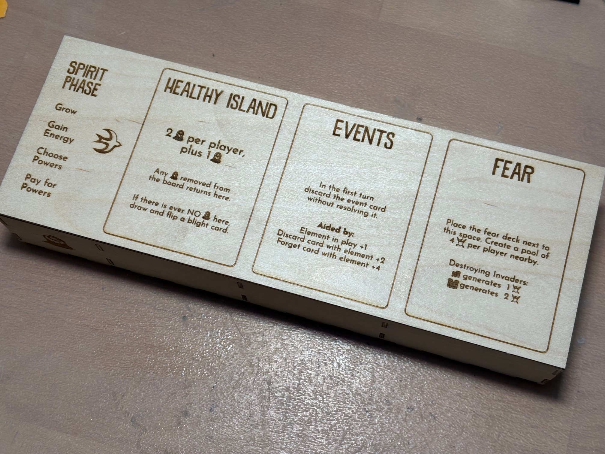
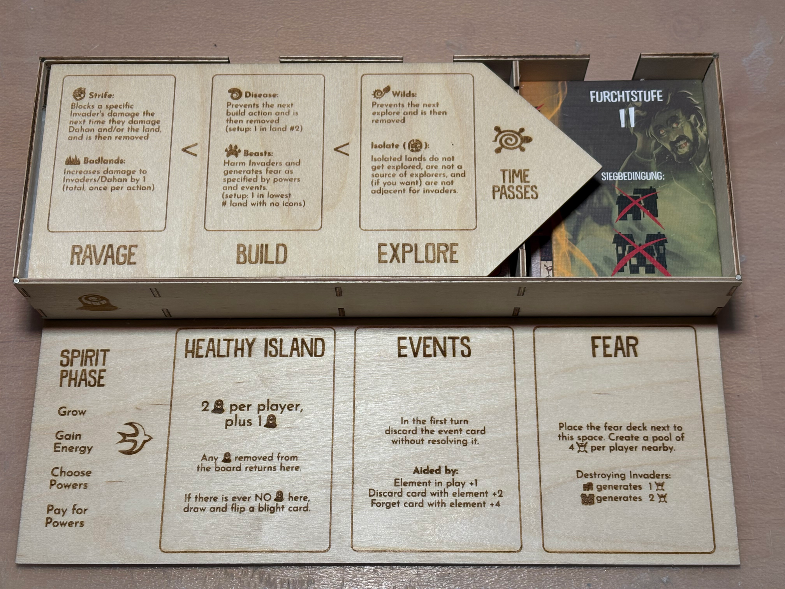
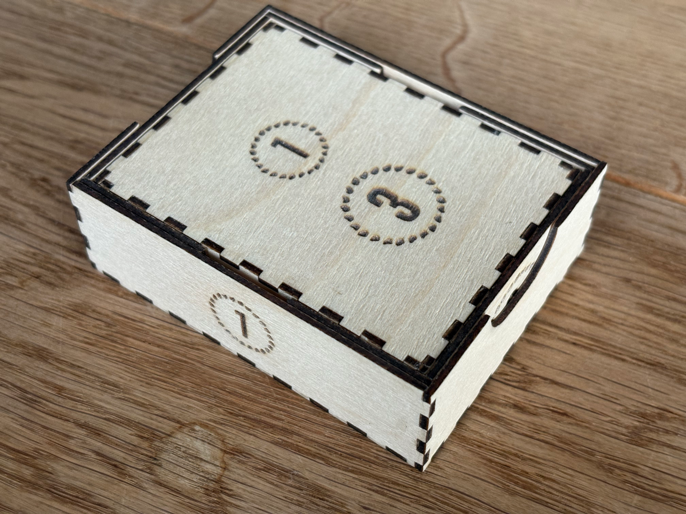
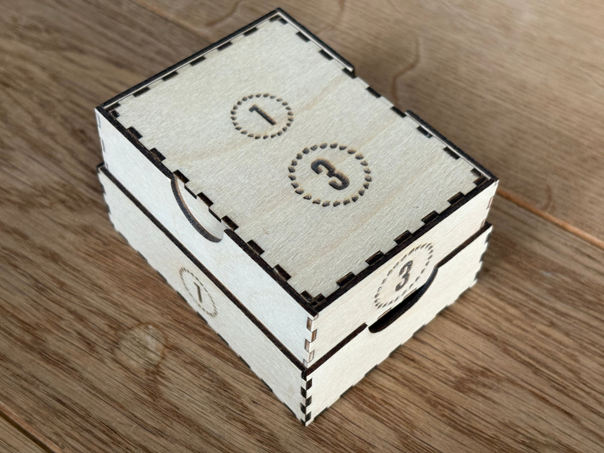
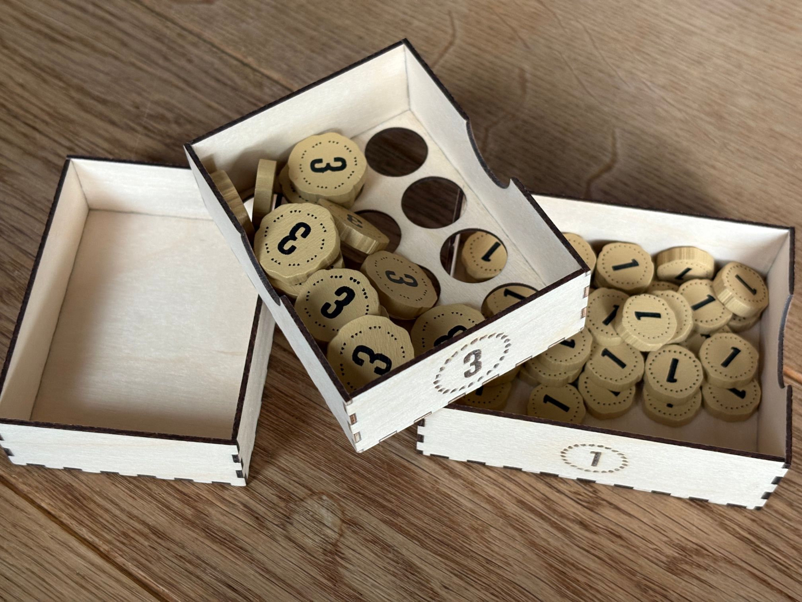

# Spirit Island

Accessories and boxes for my favourite board game of all time: [Spirit Island](https://boardgamegeek.com/boardgame/162886/spirit-island), created by Eric Reuss and published by Greater Than Games.

See images below.

Lightburn files, SVG export possible.

## Compact Invader Board

Idea and layout of the board are purely based on Padraig946's brilliant design from the [BoardGameGeek Forums](https://boardgamegeek.com/filepage/245054/spirit-island-compact-invader-board).

There's one minor change to the design: the Ravege/Build/Explore labels are placed below the cards. This is the direction the board is mostly viewed from and I had (especially new players) be confused about the current phase because invader cards/deck hid the labels.

The fonts are JosefinSans-Regular and DK Snemand Demo, icon svgs are selfmade or borrowed from spirit island wiki.

## Invader Box

A box accommodating all cards and tokens required for the invader board.
Optimized for setup time and ease of use first, and for space efficiency second.

* The invader board serves as the lid (a larger variant of the compact invader board above)
* Contains blight tokens and blight cards
* Event cards
* Fear tokens, fear cards and terror level separators
* Invader cards
* Adversary reminders (potentially)

Designed for non-sleeved cards and premium tokens. 
Sleeved cards and regular fear tokens should work as well.

Built from 2mm (2.2mm) birch plywood.

Plans:

* make wooden terror level dividers, including the "Immediate Win". That way the fear deck can be stored in the box like blight and event deck. Which reduces setup time even more.
* remake the box with 3mm ply and make the lid a sliding lid. Magnets are nice, but their adherence could be better

## Energy Box

A box for storing premium energy tokens, with a twist.
Consists of three nested boxes. 
The middle box is a sieve that separates 1-energy and 3-energy tokens when shaking the box.

Coincidentally, the box has similar dimensions to sleeved cards and could be placed into card-holders. 
Built from 1.5mm (1.55mm) birch plywood.

## Setup Box (Concept)

Idea: make setting up island boards easier by providing exactly the pieces/tokens needed for setting one board.
A box with sliding lid containing six compartments (for the six island boards). 

* City + Town
* Blight Token
* Beast + Disease
* 6 Dahan

## Dimensions for Various Things

An [edn](https://github.com/edn-format/edn) file with [dimensions](SI_dimensions.edn) for various things in Spirit Island. 

# Images

## Compact Invader Board

## Invader Box

The lid of the box is at the same time (a part of) the invader board.

The right part of the invader board is stored inside. The lid is held in place by tiny magnets in the corners of the box.

The box contains invader deck, blight deck, event deck and fear deck, including terror level deviders. 

The blight and fear tokens are hidden under the invader deck and the blight deck respectively. 
* Fear tokens are stored in groups of four to make setup faster. 
* All tokens are sealed below the cards and will not scatter even if the box is turned upside down. 
* All three nested boxes can be taken out.

## Energy Box

The energy box is roughly the size of the event deck (sleeved).

By lifting the inner sieve and shaking the box, the energy tokens can be separated. 

The sieve can be used as storage for the three-energy tokens. The innermost box can be used as a second energy tray. It also serves as a lid. 

# License 

[Attribution-NonCommercial-ShareAlike 4.0 International](https://creativecommons.org/licenses/by-nc-sa/4.0/) (CC BY-NC-SA 4.0)

